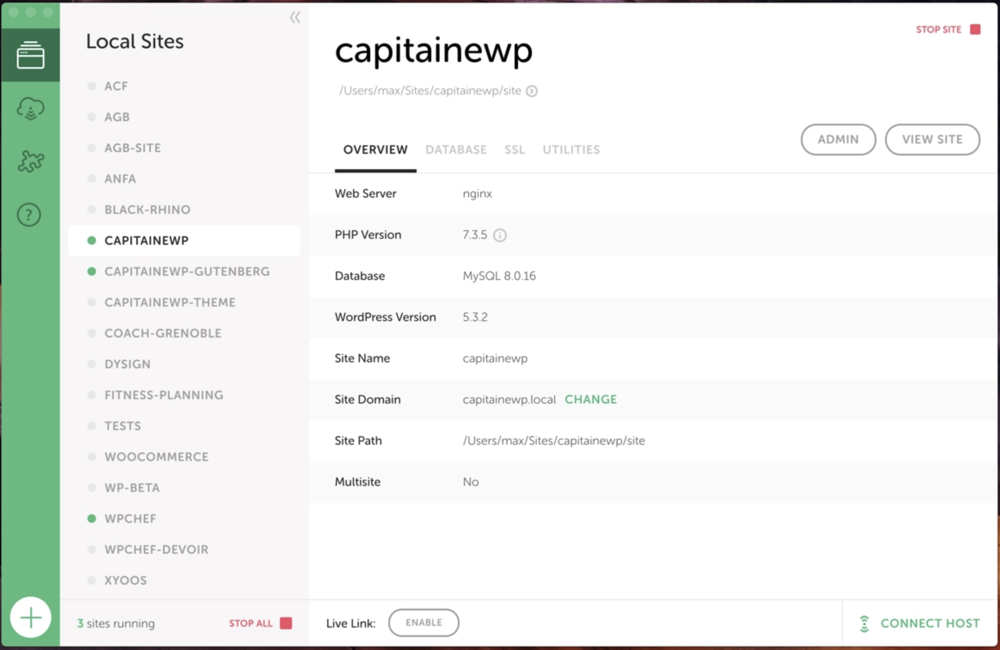
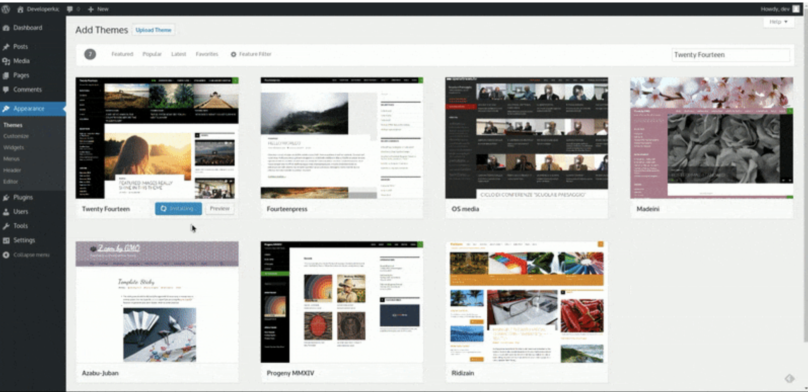
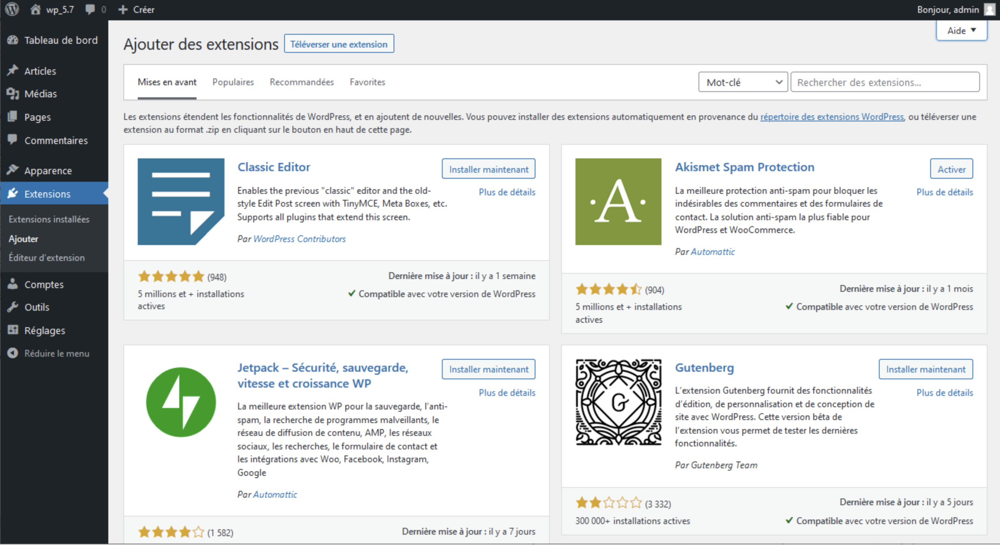

# Tutoriel installation de ***Wordpress*** en local 

## Prérequis nécessaire

- Serveur ***Apache*** ;
- Base de donnée ;

# Méthodologie
> *Plusieurs procédés sont possibles mais nous allons utiliser la methode ***Docker*** de maniére simplifiée.  
>Cela permet d'installer tout l'environnement automatiquement.*

## Installation ***LOCAL***

1. Pour ce faire commencez par télécharger l'application ***Local*** sur votre ordinateur :
[https://localwp.com/](https://localwp.com/)

> *Le site vous demandera votre système d'exploitation ainsi que quelques informations personnelles.*  

2. Une fois le logiciel installé, lancez le et vous allez pouvoir commencer la création de votre premier site. 

## ***WORDPRESS***

> *installer un site WordPress avec Local.*

**Etape 1 : indiquez un nom pour le site**  

- vous pouvez changer le nom de domaine ;
- choisir l'emplacement du site sur votre disque  ( attention créer au prealable un dossier qui accueillera les fichiers du site car ***Local*** ne le fait pas ) ; 

**Etape 2 : choix de l'environnement**  

- La plupart du temps, laissez sur ***Preferred*** et continuez.   
> *Local choisira pour vous une version récente de ***PHP*** et ***MySQL***.*
- Sinon pour choisir votre propre environnement cliquez sur ***Custom.***
> *Vous choisirez votre version de ***PHP*** et de ***MySQL***.*  

**Etape 3 : Identifiants**

- Indiquez un nom d'utilisateur ;
- un mot de passe ;
- un e-mail ;

>*Dans les options avancées vous pouvez initialiser le ***Multisite*** si vous le souhaitez.*

On valide et le tour est joué !  

>*Le site est maintenant installé et tourne dans son environnement.*

## Installation d'un thème dans ***WordPress*** 

Le système de thèmes de ***WordPress*** est une façon de mettre en forme votre site, de lui apporter une charte graphique. 
Ils apportent souvent une mise en page complètement nouvelle à votre site. 
>Vous pouvez télécharger vos thèmes depuis ***le répertoire des thèmes WordPress*** et les installer directement sur votre site.  

- Connectez-vous à votre tableau de bord.
- Allez dans le menu ***Apparence*** puis ***Thèmes***.
- Cliquez sur ***Ajouter***.
- Choisissez un thème parmi tant d'autres puis installez le afin de le téléverser sur votre site. 

>*vous pouvez utiliser la fonction ***Prévisualiser*** pour avoir un aperçu avant de l'installer.*  

## Installation d'un plugin 

L'écran ***Ajouter des extensions*** permet l'installation de plugins pour étendre les fonctionnalités de ***WordPress***.  

- Connectez-vous a votre tableau de bord. 
- Allez dans le menu ***Extensions***.
- Cliquez sur ***Ajouter***.
- ***Installez*** maintenant, cela déclenche l’installation automatique de l’extension immédiatement.

>- ***Mettre à jour maintenant*** – Lorsque l’extension est déjà installée mais pas dans la dernière version, vous pouvez la mettre à jour via ce bouton.
>- ***Activer*** – Ce bouton sera affiché, si la dernière version de l’extension est déjà installée et désactivée.
>- ***Actif*** – Ce bouton est présenté en grisé si la dernière version de l’extension est déjà installée et activée.